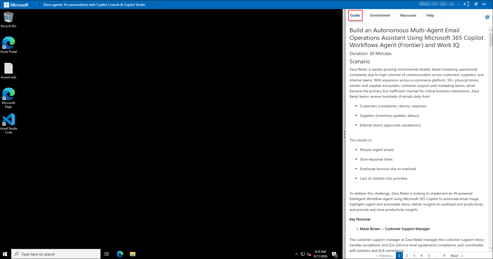
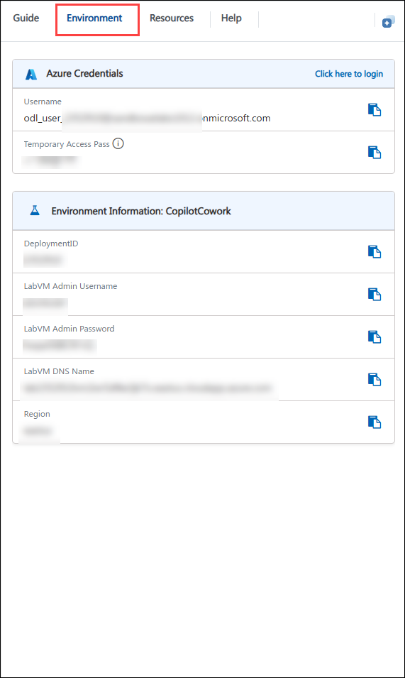
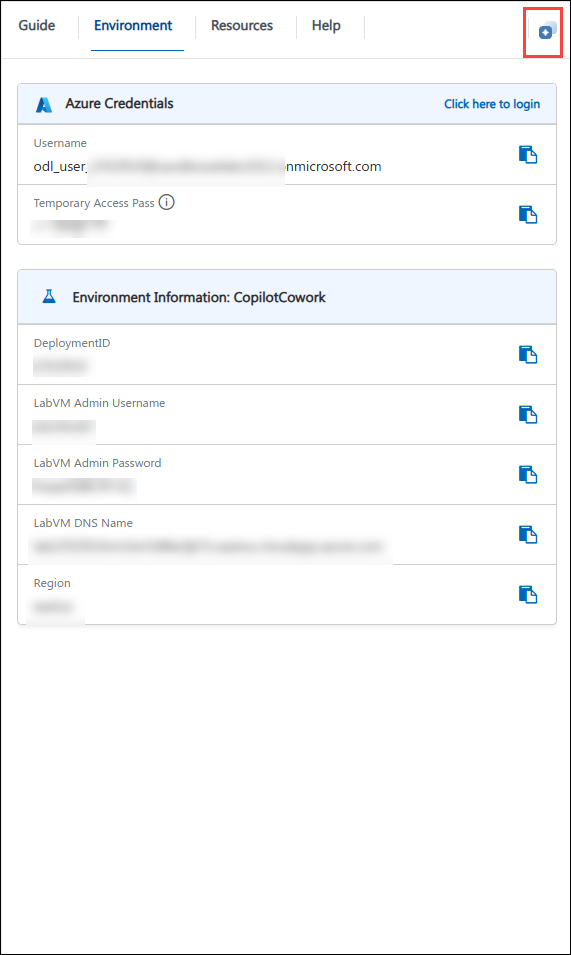
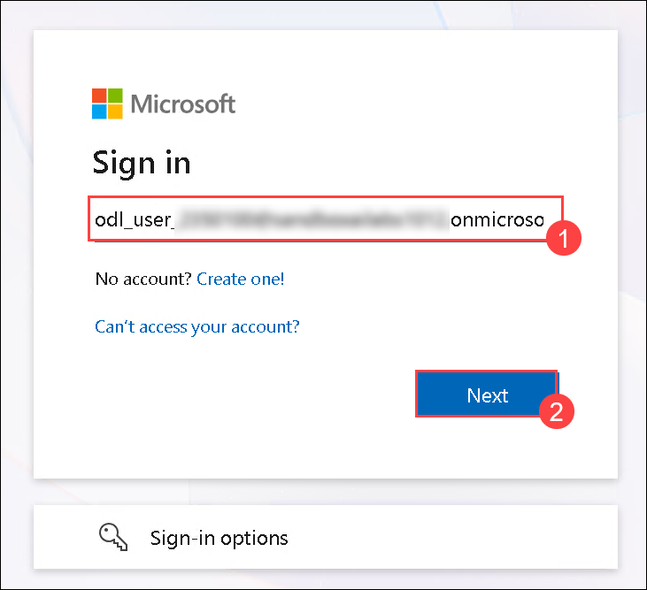
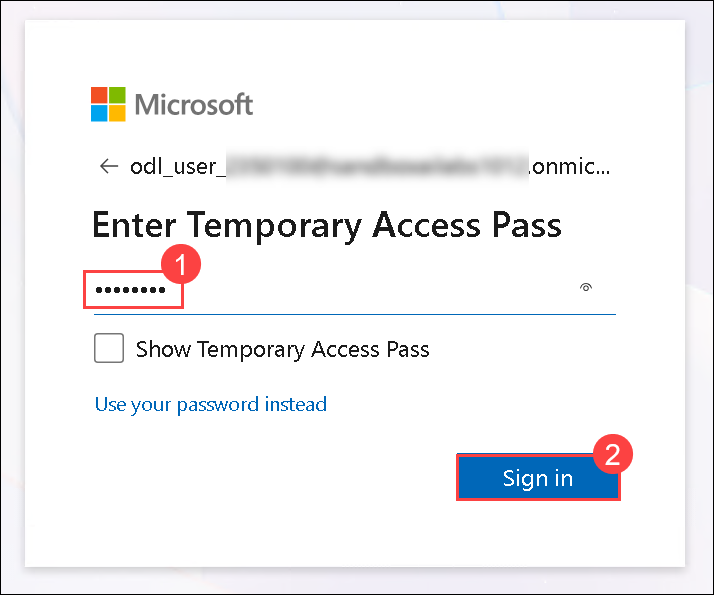
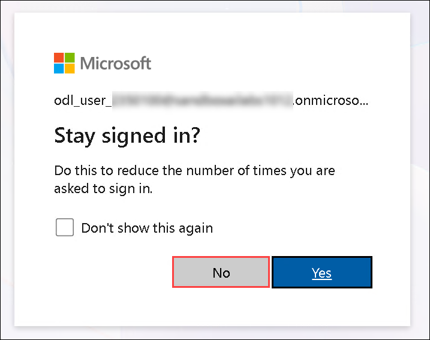

# Drive Agentic AI Conversations with Copilot Cowork & Copilot Studio

### Overall Estimated Duration: 8 Hours

## Overview

In this hands-on lab series, you will explore how Microsoft 365 Copilot, Copilot Cowork, and Microsoft Copilot Studio work together to drive agentic AI conversations across an enterprise scenario. Working through the fictional retailer **Zava Retail**, you will build, extend, and govern a range of AI agents — from autonomous email triage workflows and file-governance assistants to declarative HR agents, Computer-Using Agents (CUA), and secured multi-agent orchestrations. Along the way, you will use Microsoft 365 Copilot Chat, Copilot Cowork, Copilot Studio, SharePoint, Power Platform, Dataverse, Power Automate, Outlook, and Microsoft Teams to move from natural-language prompts to production-ready, governed AI agents.

## Objective

The primary objective of this lab series is to give you hands-on, operational fluency with agentic AI across the Microsoft 365 Copilot ecosystem. You will learn how to:

- Build an autonomous, multi-agent **email operations assistant** using the Workflows Agent (Frontier) and Work IQ, including human-in-the-loop approvals and escalation logic.
- Use **Microsoft 365 Copilot Chat** as an AI-powered digital coworker to analyze enterprise data and generate multi-format business deliverables (Excel, Word, PowerPoint, Outlook, Teams).
- Use **Copilot Cowork** to classify and rename files, run a full governance audit, and orchestrate cross-app reporting with human-in-the-loop approval gates.
- Build a **SharePoint-grounded Copilot Agent** in Copilot Studio, author advanced topics, and design multi-agent orchestration with handoffs between specialized agents.
- Use the **Create experience** in Microsoft 365 Copilot to generate executive-grade images, banners, and videos from natural language prompts.
- Extend **Microsoft 365 Copilot Chat** with a **declarative HR agent**, ground it in SharePoint knowledge, and govern it from the Microsoft 365 admin center.
- Build an autonomous **Computer-Using Agent (CUA)** that simulates human interaction with a legacy system to retrieve data without API access.
- Build an autonomous **IT Support Agent** integrated with Power Apps, Dataverse, and Power Automate to streamline ticketing.
- Design and secure a **multi-agent orchestration** in Copilot Studio with authentication, content moderation, and human escalation.

## Prerequisites

- A Microsoft 365 test/lab tenant with a Microsoft 365 Copilot license assigned to your lab user.
- Access to **Microsoft Copilot Studio** and the **Power Platform admin center**, with Maker/Environment Admin permissions in your environment.
- Access to **Copilot Cowork** and the **Workflows Agent (Frontier)** for Labs 1–3.
- Access to **SharePoint Online**, **OneDrive for Business**, **Microsoft Teams**, and **Outlook**.
- Your organization's DLP policy must allow AI actions, Dataverse (AI prompt), and Power Platform connectors for Outlook, Teams, SharePoint, Planner, and Approvals (required for Lab 1).
- A modern web browser and internet connection.

> **Note:** Microsoft recommends using the role with the fewest permissions necessary for each task. Highly privileged roles (such as Global administrator) should be used only when no other role can complete the task.

## Explanation of Components

- **Microsoft 365 Copilot Chat:** The entry point for AI-assisted conversations, grounded in your organizational data (Work IQ) and the web (Web IQ).
- **Copilot Cowork:** An agentic AI layer that orchestrates OneDrive, SharePoint, Excel, and Teams to execute multi-step tasks with human-in-the-loop approval gates.
- **Microsoft Copilot Studio:** Used to build, configure, and publish declarative and autonomous Copilot Agents, including topics, knowledge sources, tools, and multi-agent orchestration.
- **Workflows Agent (Frontier):** Converts natural-language business logic into automated, AI-reasoned workflows across Outlook, Teams, and Dataverse.
- **Computer-Using Agent (CUA):** A Copilot Studio tool that simulates human interaction with legacy systems that lack APIs.
- **Power Platform admin center & Dataverse:** Used to provision environments and store structured data (such as IT support tickets) used by Copilot Agents.
- **SharePoint & OneDrive:** Serve as the grounding knowledge sources and file repositories used throughout the lab series.
- **Microsoft Teams & Outlook:** Used as communication channels for agent-generated summaries, approvals, and escalations.

## Getting Started with the lab

Welcome to your workshop. Let's begin by making the most of this experience:

## Accessing Your Lab Environment

Once you're ready to dive in, your virtual machine and **Guide** will be right at your fingertips within your web browser.

## Lab Guide Zoom In/Zoom Out

To adjust the zoom level for the environment page, click the **A↕ : 100%** icon located next to the timer in the lab environment.

## Virtual Machine & Lab Guide

Your virtual machine is your workhorse throughout the workshop. The lab guide is your roadmap to success.

## Exploring Your Lab Resources

To get a better understanding of your lab resources and credentials, navigate to the **Environment** tab.

## Utilizing the Split Window Feature

For convenience, you can open the lab guide in a separate window by selecting the **Split Window** button from the top right corner.

## Managing Your Virtual Machine

Feel free to **Start, Stop, or Restart (2)** your virtual machine as needed from the **Resources (1)** tab. Your experience is in your hands!

## Let's Get Started with Microsoft 365 Copilot

1. On your virtual machine, open a browser and go to Microsoft 365 Copilot at `https://m365.cloud.microsoft/chat/`.

2. You'll see the **Sign in to your account** tab. Here, enter your credentials:

   - **Email/Username:** <inject key="AzureAdUserEmail"></inject>

     

   - **Password:** <inject key="AzureAdUserPassword"></inject>

     

4. If **Action required** pop-up window appears, click on **Ask later**.
5. If prompted to **stay signed in**, you can click **No**.

    

6. If a welcome or "take a tour" pop-up window appears, simply click **Cancel** or **Skip** to dismiss it.

## Support Contact

The CloudLabs support team is available 24/7, 365 days a year, via email and live chat to ensure seamless assistance at any time. We offer dedicated support channels tailored specifically for both learners and instructors, ensuring that all your needs are promptly and efficiently addressed.

Learner Support Contacts:

- Email Support: [cloudlabs-support@spektrasystems.com](mailto:cloudlabs-support@spektrasystems.com)
- Live Chat Support: https://cloudlabs.ai/labs-support

Happy learning!!